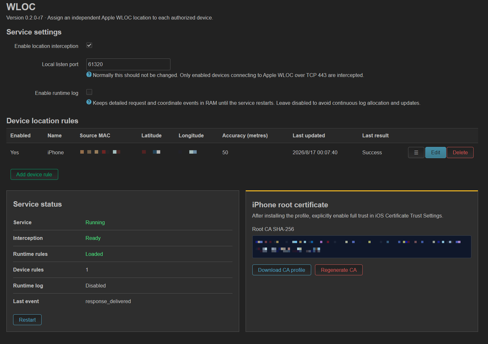

# luci-app-wloc

`luci-app-wloc` is a small OpenWrt package that assigns a virtual Apple WLOC
location baseline to each selected access point and follows each real movement
delta from that fixed baseline. It includes a native Rust service, isolated
nftables rules, UCI/procd integration, RPC support, and a LuCI interface.



Each entry binds one exact configured wireless interface to one virtual
location and optional outbound proxy. The selected `iface` is the fixed
`ifname` from a `wifi-iface`; wireless sections without one are not shown in
LuCI and are ignored by WLOC. The configured SSID is displayed for reference
only and does not identify a rule. The wireless `disabled` state does not hide
a fixed interface. Requests whose client cannot be associated with a matching
hostapd interface pass through unchanged. Use this package only on devices
you own or are authorized to test.

Each interface can also be given a daily disable window in router local time.
During the window, WLOC resolves the interface to its configured `wifi-iface`,
applies a temporary runtime `disabled` override, and reloads WiFi; the
original wireless UCI value is restored when the window ends and is never
committed by WLOC.
Equal start and end times mean all day, and an end time earlier than the start
crosses midnight. If the fixed interface is missing or ambiguous, WLOC records
a warning and leaves every other AP unchanged; it never falls back to another
AP or the whole wireless configuration.

The nftables editor accepts any ruleset accepted by `nft`; WLOC does not require
specific tables, chains, priorities, comments, or redirect forms. WLOC only
maintains two optional sets when they are declared with the expected types:
`apple_wloc_v4` (`ipv4_addr`, `flags timeout`) receives resolved Apple host
addresses, and `target_ingress_interfaces` (`ifname`, `flags timeout`) receives
the configured AP interfaces. Other rules and sets are left unchanged. If a
set is absent or has another type, WLOC skips its maintenance without rejecting
the rest of the ruleset.

For example, these APs may share one bridge without sharing a WLOC identity:

```text
phy0-ap0      ─┐
phy0-ap1      ─┼─ br-lan
phy1-ap0      ─┘
```

Binding `phy0-ap0` to Los Angeles and `phy0-ap1` to Tokyo affects only clients
whose hostapd association reports the corresponding interface; `phy1-ap0` and
wired clients pass through unless they receive their own WLOC rule.

WLOC does not inspect or rewrite nftables rule priority. The relationship between
custom rules and the WLOC listener is entirely controlled by the ruleset you
enter.

WLOC does not install a TPROXY stage, policy route, or OUTPUT hook. The client
connection is redirected to WLOC first. After WLOC handles it, the daemon's
upstream socket is ordinary router-local output, so any other proxy—including
a transparent proxy—with a matching OUTPUT policy can process it normally.

## Supported targets

- Xiaomi AX3000T and other OpenWrt 25.12.5 MediaTek Filogic devices
  (`aarch64_cortex-a53`)
- OpenWrt 25.12.5 x86/64 devices (`x86_64`)

## Build

Run the build on Linux x86_64. WSL2 is also supported.

Package versions are configured only in `version.env`. Update
`WLOC_VERSION` for an application release, and `WLOC_RELEASE` when rebuilding
the same application version with packaging-only changes.

```sh
# MediaTek Filogic
bash ./scripts/build-openwrt-25.12.5.sh filogic

# OpenWrt x86/64
bash ./scripts/build-openwrt-25.12.5.sh x86_64
```

The script downloads and verifies the official OpenWrt SDK, builds the native
musl binary and APK package, validates the result, and writes artifacts to
`dist/filogic/` or `dist/x86_64/`. GitHub Actions runs fast host checks on normal
pushes, pull requests, and every release tag. The two architecture builds run
only for a `v*` tag or a manual workflow dispatch, avoiding duplicate SDK builds
for every commit. CI
caches each architecture's checksum-pinned SDK archive and Cargo downloads,
while the build script still verifies the SDK SHA-256 on every run. A tag must
match `v${WLOC_VERSION}-r${WLOC_RELEASE}` and creates a GitHub Release containing
both architecture-specific APKs and their SHA-256 files.

## Install

Copy the APK for your architecture to the router and install it:

```sh
apk add --allow-untrusted ./luci-app-wloc-*.apk
```

Open **Services > WLOC** in LuCI, add an AP, select its exact fixed interface,
and enter its fixed WGS84 latitude and longitude baseline, then save and apply.
Add a fixed `option ifname` to each selected `wifi-iface` in
`/etc/config/wireless`. WLOC stores the fixed interface, shows its configured
SSID as a third-column reference, and adds the interface directly; it does not
scan the bridge or runtime interfaces. A missing fixed name means the AP is
not shown and cannot be selected. Changing the SSID does not affect the rule;
changing or removing the fixed interface requires selecting the new interface
in the rule. On every
service start, the first real location establishes the reference. Every later
response uses the fixed virtual baseline plus the difference between the
current and previous real location. The upstream accuracy is preserved
unchanged. Install the
generated CA profile on the devices and explicitly enable full trust in iOS
Certificate Trust Settings. Each AP can use the router's direct connection, an
HTTP CONNECT proxy, or an unauthenticated SOCKS5 proxy for its Apple WLOC traffic.

The generated CA key and certificate are retained by OpenWrt sysupgrade so
trusted devices do not unexpectedly lose interception after a firmware update.
Because a sysupgrade backup therefore contains the private CA key, store backup
archives securely. The downloadable mobileconfig uses stable identifiers and is
rewritten only when its CA changes.

The default local listener is TCP port `61520` and can be changed in LuCI under
Service settings. WLOC runs with the service's existing user and group
identity; it does not change the daemon GID. The daemon starts independently of
the nftables layout and periodically retries only the optional set maintenance.
Upgrades migrate the previous `8443`, `58443`, and `28443` defaults while retaining
any other custom port. WLOC checks that the selected port is free before installing
interception rules and stops safely if another router service already owns it.

WLOC intercepts exactly these two fixed Apple WLOC endpoints:

- `gs-loc.apple.com`
- `gs-loc-cn.apple.com`

They are shown as read-only values in Service settings and are not configurable.
The optional debug mode returns `{"wloc":"ok"}` for requests to these endpoints
without contacting the upstream server.

The LuCI **Interception status** reports whether the service is actually usable:
`Active`, `Recovering`, `Error`, `Disabled`, or `Traffic conflict`. After a
firewall **Save & apply**, WLOC immediately reconciles its dynamic sets when the
listener is ready; if the daemon or a runtime update is temporarily unavailable,
the sets remain fail-open and the daemon retries automatically. Normal firewall
or runtime recovery does not require a manual **Restart service**.

## License

MIT. See [LICENSE](LICENSE) and [NOTICE](NOTICE).
